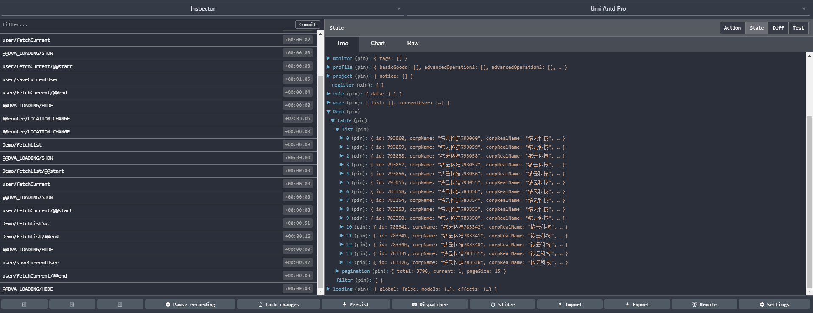

## 写在前面

因为资源有限，本项目参考了Ant Design Pro的设计与项目组织结构。团队大部分人员多为后台人员，并无现代框架开发经验。

建议在开发之前快速浏览 [react官网](http://www.css88.com/react/),学习基本的框架知识。
也可以快速浏览一下[TypeScript](https://www.tslang.cn/docs/handbook/typescript-in-5-minutes.html) 的特性，看看与java有什么不同.

这里有一篇[react最小知识集](https://dvajs.com/knowledgemap/)，可以帮助大家快速学习.

## 前序准备

你的本地环境需要安装 [node](http://nodejs.org/),根据系统版本选择版本下载即可，无需配置系统环境变量

## 安装


安装依赖。
```bash
$ npm install
```

> 如果网络状况不佳，可以使用 [cnpm](https://cnpmjs.org/) 进行加速。

```bash
$ npm run  start
```

## 技术栈: 
- [react](http://www.css88.com/react/)

- [umi](https://umijs.org/) 一个开发框架，目前包含打包工具 + 路由，已经包含了react、router，不包含数据和视图。

- [dva](http://github.com/dvajs/dva) 基于 redux、redux-saga 和 react-router 的封装的轻量级数据流框架。

- [TypeScript](https://www.tslang.cn/docs/handbook/typescript-in-5-minutes.html) : Js的强类型版本,类似于java，用tslint做代码规范

- UI库选择为 [Ant Design](https://ant.design/docs/react/introduce-cn)


## 目录结构

下面是整个项目的目录结构。业务开发聚焦于pages目录下即可

```bash
├── mock                     # 本地模拟数据
├── dist                     # 打包过后部署到服务器上的静态资源
├── public
│   └── favicon.ico          # Favicon
├── src
│   ├── assets               # 本地静态资源
│   ├── common               # 应用公用配置，如导航信息
│   ├── components           # 业务通用组件
│   ├── layouts              # 通用布局
│   ├── models               # dva model
│   ├── pages                # 业务页面入口和常用模板(所有的业务页面)
│   ├── services             # 全局后台接口服务
│   ├── utils                # 工具库
│   ├── theme.js             # 主题配置
│   ├── index.ejs            # HTML 入口模板
│   ├── dva.ts               # dva全局配置文件
│   ├── global.less          # 全局样式
├── README.md                # 项目配置
└── package.json             # 前端项目资源配置文件
├── package.json             # 项目信息
├── tsconfig.json            # TypeScript配置
├── .umirc.mock.js           # 配置mock
├── globals.d.ts             # 配置TS全局的声明文件
├── tslint.json              # TSlint配置
├── .webpackrc.js            # webpack配置
└── .umirc.js                # umi配置
```


## 路由约定(重要)

### 基础路由

假设 `pages` 目录结构如下：

```
+ pages/
  + users/
    - index.js
    - list.js
  - index.js
```

那么，umi 会自动生成路由配置如下：

```js
[
  { path: '/': exact: true, component: './pages/index.js' },
  { path: '/users/': exact: true, component: './pages/users/index.js' },
  { path: '/users/list': exact: true, component: './pages/users/list.js' },
]
```

### 动态路由

umi 里约定，带 $ 前缀的目录或文件为动态路由。

比如以下目录结构：

```
+ pages/
  + $post/
    - index.js
    - comments.js
  + users/
    $id.js
  - index.js
```

会生成路由配置如下：

```js
[
  { path: '/': exact: true, component: './pages/index.js' },
  { path: '/users/:id': exact: true, component: './pages/users/$id.js' },
  { path: '/:post/': exact: true, component: './pages/$post/index.js' },
  { path: '/:post/comments': exact: true, component: './pages/$post/comments.js' },
]
```
更多可以查看[umi.js路由文档](https://umijs.org/guide/router.html#%E5%9F%BA%E7%A1%80%E8%B7%AF%E7%94%B1)

## 基本教程

本教程主要是引导大家完成一个基本的带有搜索输入框，以及带有自动分页请求的表格。这个教程是涉及了诸多前端概念。只是给大家一个流程性的指导，怎么去做。

我们约定pages目录下为我们所有的页面,通过文件夹来组织模块。例如我们要做Demo模块，在pages下新建Demo文件夹,新建一个名为TableDemo后缀为.tsx的文件。

这个时候，就会为我们自动生成一条/Demo/TableDemo的路由信息，目录如下:

```
├── pages               
├── ├── Demo           
├── ├── ├── TableDemo.tsx      // TableDemo页面
├── ├── ├── models             // TableDemo 处理数据和逻辑。
├── ├── ├── services          //  接口文件
├── ├── ├── components        //  页面级的公用组件
```

新建 .TableDemo.tsx文件，这个时候在页面上会出现一条的TableDemo的信息

```
import React, { Component } from 'react';

export default class TableDemo extends Component {

  render() {
    return (
      <div>
        TableDemo
      </div>
    );
  }
}
```


你可以理解react就是一个功能强大的模板引擎，把传统的html放在render()方法中return()中,接下来引入
Filter组件，和BaseTable组件。

```
import * as React from 'react';
import { connect } from 'dva';
import { Card, Button } from 'antd';
import PageHeaderLayout from '../../layouts/PageHeaderLayout';
import { Filter, BaseTable } from './components';

export default class TableDemo extends React.Component<any, any> {

  render() {
    const columns = [{
      title: '账号/公司名称',
      dataIndex: 'corpName',
      width: 250,
    },
    {
      title: '商机级别',
      width: 250,
      dataIndex: 'platCustomerSalesExtView.customerLevel',
    },
    {
      title: '是否付费',
      width: 100,
      dataIndex: 'serviceInstance.isPaid',
    },
    {
      title: '开通日期',
      dataIndex: 'serviceInstance.beginTime',
    },
    {
      title: '到期日期',
      dataIndex: 'serviceInstance.endTime',
    },
    {
      title: '操作',
      key: 'operation',
      fixed: 'right',
      width: 100,
      render: () => <Button onClick={this.rollOut}>转出</Button>,
    }];

    return (
      <PageHeaderLayout>
        <Card bordered={false}>
          <Filter />
          <BaseTable
            data={table}
            columns={columns}
            loading={loading}
            query={this.query}
            bordered
          />
        </Card>
      </PageHeaderLayout>
    );
  }
}
```


这样基本的ui就已经完成。这个时候还是没有数据的静态页面，我们需要数据来填充。下来以商机列表为例。

关于table表头信息，可以参考ant desingnw文档


新建一个接口，在 `services/index.ts` 中添加一个fetchList方法.它返回了一个post请求，url为：/api/customer/customerView
```
import request from 'utils/request';

export async function fetchList(params) {
  return request({
    url: '/api/customer/customerView',
    method: 'post',
    data: params,
  });
}
```
再添加一个get请求
```
export async function fetchRecord(params) {
  return request({
    url: '/api/record/listRecord',
    params,
  })
```

接着新建 model `models/demo.ts` 。接下来在开发体验上可以理解为mvc。
```
import { fetchList } from '../services';

export default {
  namespace: 'Demo',
  state: {},
  effects: {},
  reducers: {},
};
```
在这个文件暴露了一个对象。
state可以理解成为mvc中的m, effects可以简单的理解成异步控制器(用于异步操作，不阻塞)，reducers可以理解成同步的控制器

继续添加以下代码
```
  effects: {
    *fetchList(action, { call, put }) {
      const data = yield call(fetchList, action.payload);
      console.log(data);
      if (data.code === 200) {
        yield put({ type: 'fetchListSuc', payload: data.data });
      } else {
        throw data;
      }
    },
  },
  reducers: {
    fetchListSuc(state, { payload }) {
      return {
        ...state,
        table: {
          list: payload.items,
          pagination: {
            total: payload.totalCount,
            current: payload.currentPage,
            pageSize: payload.pageSize,
          },
        },
      };
    }
  },
}

```
在effects对象中，添加一个名为 *fetchList的方法，注意前有*.

在这个方法中使用`call(fetchList，action.payload)`,其中`fetchList`为请求方法(services中导出那个)，`action.payload`请求为参数。然后把它赋值给了data。这里把异步的请求改成了同步的写发

`const data=yield call(fetchList, action.payload)`

接着判别

```
  if (data.code === 200) {
        yield put({ type: 'fetchListSuc', payload: data.data });
  } else {
        throw data;
  }
```

很明显在code为200的时候调用了reducers中的fetchListSuc,它返回了一个新对象.reducer必须返回一个新对象。

```
 fetchListSuc(state, { payload }) {
      return {
        ...state,
        table: {
          list: payload.items,
          pagination: {
            total: payload.totalCount,
            current: payload.currentPage,
            pageSize: payload.pageSize,
          },
        },
      };
    }
```


下来我在页面中，将sotre与页面建立链接
```
const mapStateToProps = (state) => ({
  table: state.Demo.table,
});

@connect(mapStateToProps)
export default class TableDemo extends React.Component<any, any> {
  componentDidMount() {
    this.props.dispatch({
      type: 'Demo/fetchList',
      payload: pamams,
    });
  }
}
```
在`componentDidMount`,相当于document.ready时调用。



在开发者工具中可以看到，demo对象中的table有一个list数据，和pagination对象，一个基本的数据流完成.数据连接到视图，会自动渲染生成.具有自动分页。

。

总结:

在页面加载的时候

 - 发起了一个dispatch (相当于一个后端mvc中用户发起请求)
 - `dispatch(action:{type: 'Demo/fetchList',payload: pamams})`，(相当于用户请求`type` 表示请求的 URL，`payload`  表示请求的数据)
 -  然后进入effects中 （ 路由 + 异步控制器（handler））
 -  处理成功然后进入reducer中 （ 路由 +控制器（handler））
 - `reducer` 内部对 `state` 的处理 | 控制器对数据库进行增删改操作
 - `reducer` 返回 `nextState` | 将修改后的记录写回数据库


### Redux 与传统后端 MVC 的对照
Redux | 传统后端 MVC
---|---
`store(上图中的store)` | 数据库实例
`state(上图中的demo对象)` | 数据库中存储的数据
`dispatch(action)` | 用户发起请求
`action: { type, payload }` | `type` 表示请求的 URL，`payload` 表示请求的数据
`reducer` | 路由 + 控制器（handler）
`reducer` 中的 `switch-case` 分支 | 路由，根据 `action.type` 路由到对应的控制器
`reducer` 内部对 `state` 的处理 | 控制器对数据库进行增删改操作
`reducer` 返回 `nextState` | 将修改后的记录写回数据库。

